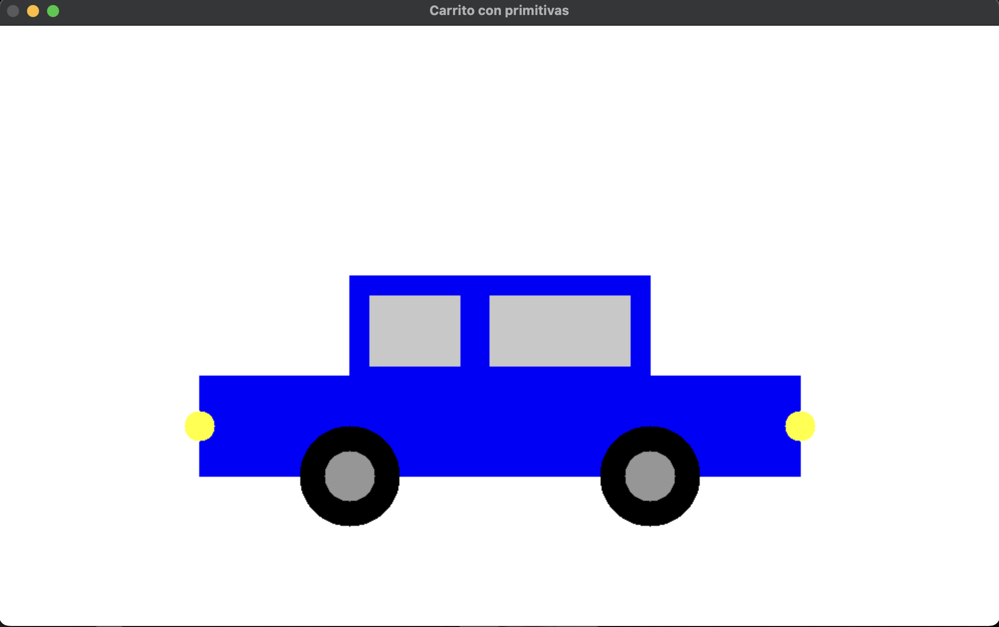

# Carrito usando primitivas en OpenCV

Este programa utiliza Python, OpenCV y NumPy para dibujar un carrito empleando primitivas gráficas, como rectángulos y círculos, sobre una imagen en blanco.

## Importación de librerías
```python
import cv2 as cv
import numpy as np
```

cv2 (OpenCV): se utiliza para dibujar figuras geométricas y mostrar imágenes.

NumPy: permite crear y manipular arreglos que representan imágenes.

## Creación del canvas
```python
img = np.ones((600, 1000, 3), np.uint8) * 255
```
- Se crea una imagen de 600 px de alto por 1000 px de ancho.
- 3 representa los canales de color (BGR).
- 255 hace que el fondo sea blanco.

## Cuerpo del carrito
Base del carro
```python 
cv.rectangle(img, (200, 350), (800, 450), (255, 0, 0), -1)
```
- Dibuja un rectángulo azul.
- -1 indica que la figura se rellena completamente.

## Parte superior
```pyhton
cv.rectangle(img, (350, 250), (650, 350), (255, 0, 0), -1)
```
Representa el techo del carro.
Mantiene el mismo color que la base para dar uniformidad.

## Ventanas
```python
cv.rectangle(img, (370, 270), (460, 340), (200, 200, 200), -1)
cv.rectangle(img, (490, 270), (630, 340), (200, 200, 200), -1)
```
Dos rectángulos de color gris claro.
Simulan las ventanas delanteras y traseras.

## Ruedas
Rueda izquierda
```python 
cv.circle(img, (350, 450), 50, (0, 0, 0), -1)
cv.circle(img, (350, 450), 25, (150, 150, 150), -1)
```
- Círculo grande negro → llanta.
- Círculo pequeño gris → rin.

Rueda derecha
```python
cv.circle(img, (650, 450), 50, (0, 0, 0), -1)
cv.circle(img, (650, 450), 25, (150, 150, 150), -1)
```
- Misma lógica que la rueda izquierda para mantener simetría.

## Faros
```python 
cv.circle(img, (800, 400), 15, (0, 255, 255), -1)
cv.circle(img, (200, 400), 15, (0, 255, 255), -1)
```
Círculos amarillos.


## Mostrar la imagen
```python 
cv.imshow("Carrito con primitivas", img)
cv.waitKey(0)
cv.destroyAllWindows()
```

imshow → muestra la imagen en una ventana.

waitKey(0) → espera hasta que el usuario presione una tecla.

destroyAllWindows() → cierra todas las ventanas abiertas.

