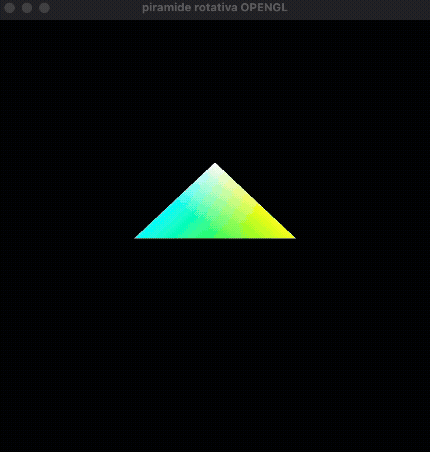

# Pirámide Rotativa en OpenGL

Este proyecto muestra una **pirámide 3D rotando** utilizando **OpenGL** con **PyOpenGL** y **GLFW** en Python. El objetivo es demostrar el uso básico del pipeline gráfico fijo: proyección, transformaciones, buffers y dibujo de primitivas.

---

## Características

* Renderizado 3D con OpenGL
* Uso de **GLFW** para manejo de ventana y contexto
* Prueba de profundidad habilitada (`GL_DEPTH_TEST`)
* Pirámide formada por **triángulos**
* Rotación automática en cada frame

---


##  Estructura del programa

* **Variables globales**: control de ventana y ángulo de rotación
* **`init()`**: configuración inicial de OpenGL
* **`draw_pyramid()`**: renderizado y animación de la pirámide
* **`main()`**: inicialización de GLFW y bucle principal

---

##  Explicación del código

### Variables globales

```python
window = None
angle = 0
```

* `window`: referencia a la ventana GLFW
* `angle`: controla la rotación de la pirámide

---

### Inicialización de OpenGL (`init()`)

```python
glClearColor(0.0, 0.0, 0.0, 1.0)
glEnable(GL_DEPTH_TEST)
```

* Define el color de fondo (negro)
* Activa el **buffer de profundidad** para renderizado 3D correcto

```python
glMatrixMode(GL_PROJECTION)
gluPerspective(45, 1.0, 0.1, 50.0)
```

* Configura la proyección en perspectiva
* Campo de visión de 45°

---

### Dibujo de la pirámide (`draw_pyramid()`)

```python
glClear(GL_COLOR_BUFFER_BIT | GL_DEPTH_BUFFER_BIT)
```

* Limpia la pantalla y el buffer de profundidad

```python
glTranslatef(0, 0, -7)
glRotatef(angle, 0, 0, 0)
```

* Desplaza la pirámide hacia atrás
* Aplica la rotación (animación)

---

### Vértices

```python
base1 = (1.0, 0, 0.5)
base2 = (-1.0, 0, 0.5)
base3 = (0.0, 0, -1.0)
punta = (0,1,0)
```

* Tres vértices para la base
* Un vértice superior (punta)

---

### Dibujo con triángulos

```python
glBegin(GL_TRIANGLES)
```

* Cada cara de la pirámide se dibuja como un triángulo
* Se asignan colores distintos a cada cara

---

### Animación

```python
angle += 1
glfw.swap_buffers(window)
```

* Incrementa el ángulo para simular rotación
* Intercambia buffers para evitar parpadeo

---

## Bucle principal

```python
while not glfw.window_should_close(window):
    draw_pyramid()
    glfw.poll_events()
```

* Mantiene la ventana activa
* Redibuja la escena en cada frame

---


##  Evidencia visual




