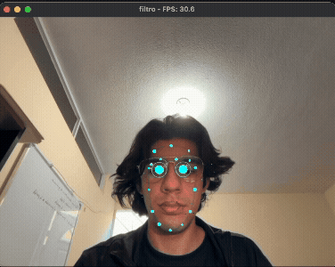

#  Filtro Cibernético Facial en Tiempo Real

Este proyecto implementa un **filtro facial cibernético 3D en tiempo real** utilizando **Python**, combinando **visión por computadora** y **renderizado gráfico con OpenGL**.

El sistema captura video desde la cámara, detecta los puntos clave del rostro y dibuja efectos visuales animados como circuitos, ojos robóticos, boca reactiva y partículas flotantes.

---

##  Imports

* **Python 3**
* **OpenCV** – Captura y procesamiento de video
* **MediaPipe Face Mesh** – Detección de landmarks faciales
* **OpenGL (PyOpenGL)** – Renderizado 3D
* **GLFW** – Ventana OpenGL y manejo de eventos
* **NumPy** – Operaciones matemáticas

---

## ¿Como funciona?

1. Se inicializa una ventana OpenGL usando GLFW.
2. Se captura video en tiempo real desde la cámara web.
3. MediaPipe detecta la cara y obtiene más de 400 puntos faciales (landmarks).
4. Los landmarks se normalizan para coincidir con el sistema de coordenadas de OpenGL.
5. Se renderiza el video como fondo.
6. Se dibujan efectos cibernéticos animados sobre el rostro.

---

##  Efectos 

###  Circuitos faciales

* Líneas tipo **neón** siguiendo el contorno del rostro, cejas y otras zonas.
* Animación de pulso usando funciones seno.
* Nodos representados con pequeñas esferas brillantes.

###  Ojos cibernéticos

* Anillos pulsantes alrededor de cada ojo.
* Líneas de escaneo giratorias.
* Núcleo brillante en el centro del ojo.

###  Boca reactiva

* Detecta la apertura de la boca.
* Cambia color e intensidad según el nivel de apertura.
* Muestra líneas verticales cuando la boca se abre.

###  Partículas de datos

* Partículas orbitando el centro del rostro (nariz).
* Movimiento circular y vertical.
* Brillo dinámico para simular flujo de datos.

---

## Estructura del código

### Inicialización

* `inicializar_glfw()` – Crea la ventana OpenGL.
* `configurar_opengl()` – Activa profundidad, transparencias y suavizado.
* `configurar_luces()` – Configura luces y materiales.

### Utilidades gráficas

* `normalizar_punto()` – Convierte coordenadas de MediaPipe a OpenGL.
* `dibujar_esfera()` – Dibuja nodos y núcleos.
* `dibujar_cilindro()` – Conexiones 3D.
* `dibujar_linea_brillante()` – Efecto de línea neón.

### Efectos faciales

* `circuito()` – Circuitos animados sobre el rostro.
* `dibujar_ojo_cibernetico()` – Ojos robóticos con escaneo.
* `boca()` – Boca reactiva al movimiento.
* `dibujar_particulas_datos()` – Partículas flotantes.

### Renderizado

* `renderizar_fondo_video()` – Dibuja el video como textura 2D.
* `renderizar_filtro_cibernetico()` – Renderiza todos los efectos 3D.

### Ejecución

* `principal()` – Loop principal del programa.

---

##  Objetivo del proyecto

Este proyecto demuestra la integración de:

* Visión por computadora
* Detección facial basada en IA
* Gráficos 3D en tiempo real
con un enfoque creativo en **filtros interactivos y efectos visuales avanzados**.
---
# Evidencia de la ejecucion del prgrama 

